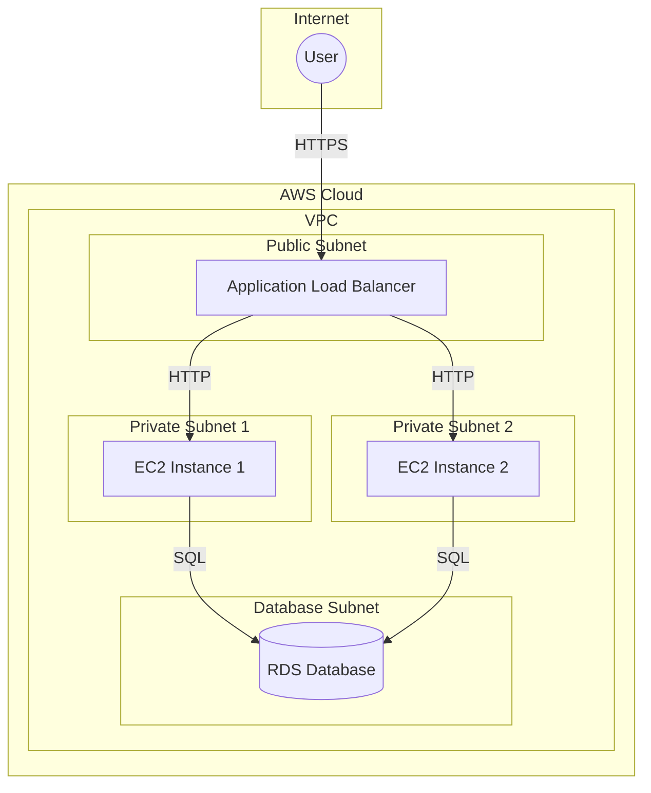

```mermaid
graph TB
    subgraph Internet
        User((User))
    end

    subgraph AWS Cloud
        subgraph VPC[VPC]
            subgraph Public Subnet
                ALB[Application Load Balancer]
            end
            
            subgraph Private Subnet 1
                EC2_1[EC2 Instance 1]
            end
            
            subgraph Private Subnet 2
                EC2_2[EC2 Instance 2]
            end
            
            subgraph Database Subnet
                RDS[(RDS Database)]
            end
        end
    end
    
    User -->|HTTPS| ALB
    ALB -->|HTTP| EC2_1
    ALB -->|HTTP| EC2_2
    EC2_1 -->|SQL| RDS
    EC2_2 -->|SQL| RDS
```
